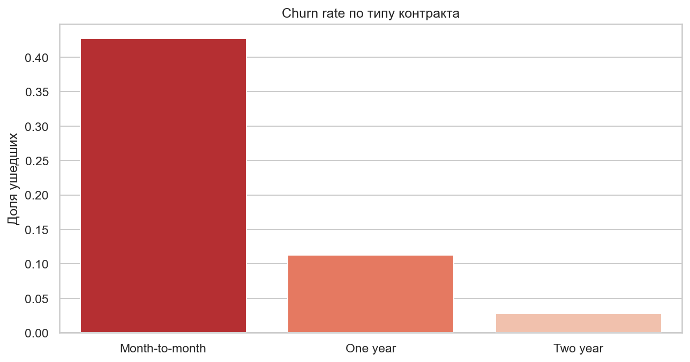
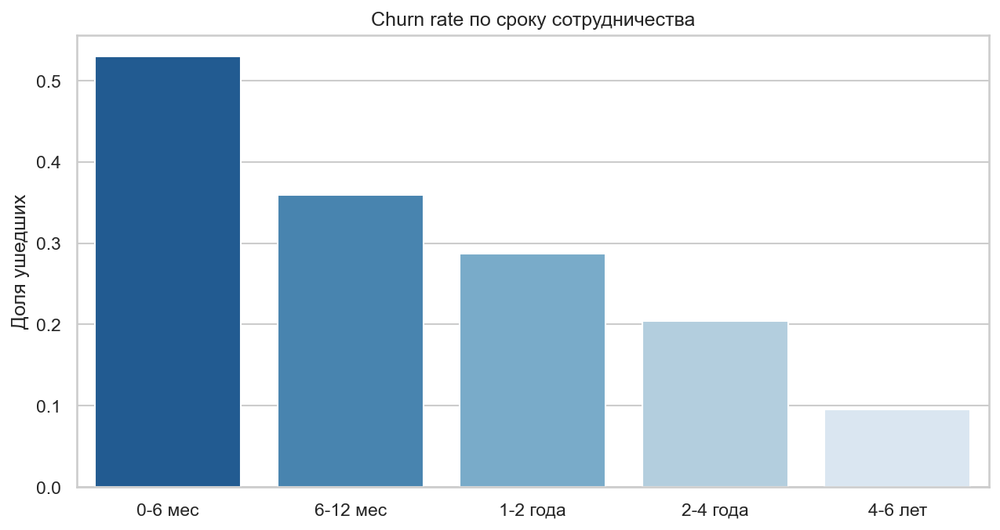
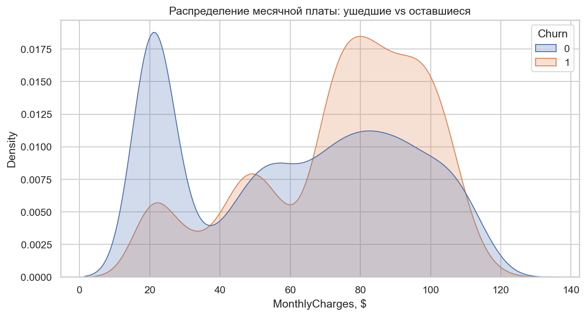
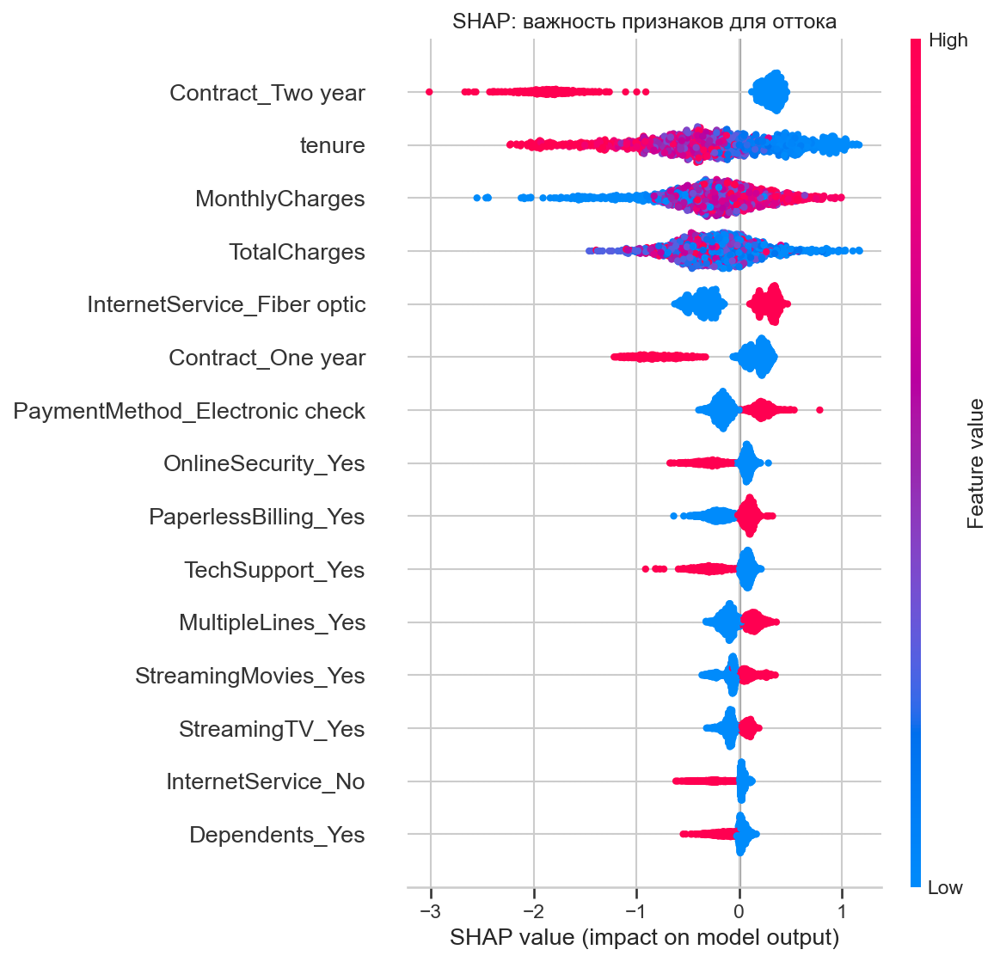

# Telco Customer Churn — Predictive Analytics

End-to-end ML-проект по прогнозированию оттока клиентов телеком-оператора с оценкой денежного эффекта кампании удержания.

## Бизнес-задача

Оператор теряет **26.5%** клиентов. Каждый ушедший клиент = потеря ~$1500 LTV. Задача - выявить клиентов с высоким риском оттока заранее и предложить таргетированную кампанию удержания с положительным ROI.

## Результаты

| Метрика | Значение |
|---|---|
| LogReg ROC-AUC (baseline) | **0.8417** |
| Lift@20% | **2.48x** |
| Churn rate в топ-20% риска | 65.8% (vs 26.5% в среднем) |
| ROI кампании удержания | **4.93x** |
| Чистая прибыль (на тестовой выборке 1409 клиентов) | **$69,200** |
| Extrapolated profit (на всей базе 7043 клиента) | **~$345K / год** |

## Бизнес-инсайты

1. **Month-to-month контракт - churn 42.7%** против 11.3% на годовых и 2.8% на двухлетних. Разница в 15 раз.
2. **Первые 6 месяцев - зона максимального риска:** 52.9% клиентов уходят. После 4 лет - только 9.5%.
3. **Fiber optic без доп. услуг** - повышенный отток. Клиенты с `OnlineSecurity` и `TechSupport` уходят на 30–40% реже.
4. **`tenure` - сильнейший отрицательный предиктор** (коэффициент −1.16 в логрег, топ-2 в SHAP).
5. **Топ-20% по риску ловит 49% всех уходов** - модель позволяет в 5 раз сократить бюджет кампании удержания.

## Методология

- **EDA:** распределения, корреляции, сегментация по tenure и contract.
- **Feature engineering:** обработка `TotalCharges` (11 пропусков = новые клиенты), one-hot для категорий, стандартизация чисел.
- **Модель:** LogisticRegression (baseline) + XGBoost.
- **Дисбаланс классов:** `class_weight="balanced"` и `scale_pos_weight`.
- **Валидация:** стратифицированный train/test split (80/20).
- **Интерпретация:** SHAP TreeExplainer + коэффициенты линейной модели.
- **Бизнес-оценка:** Lift, ROI, net profit с допущениями LTV=$1500, offer cost=$50, uplift=30%.

## Ключевые графики

| Churn по контракту | Churn по tenure |
|---|---|
|  |  |

| Распределение MonthlyCharges | SHAP summary |
|---|---|
|  |  |

## Стек

- **Данные:** pandas, numpy
- **Визуализация:** matplotlib, seaborn
- **ML:** scikit-learn, XGBoost
- **Интерпретация:** SHAP
- **Окружение:** Python 3.12, venv, VS Code, Jupyter

## Структура проекта

```
data_analysis/
├── data/raw/telco_churn.csv          # Kaggle: blastchar/telco-customer-churn
├── notebooks/01_eda.ipynb            # весь анализ и моделирование
├── reports/
│   ├── figures/                      # графики
│   └── results.md                    # сырые метрики
└── README.md
```

## Воспроизведение

```powershell
python -m venv .venv
.venv\Scripts\Activate.ps1
pip install pandas numpy matplotlib seaborn scikit-learn xgboost shap jupyter
# Скачай датасет с Kaggle: blastchar/telco-customer-churn
# Положи CSV в data/raw/telco_churn.csv
# Открой notebooks/01_eda.ipynb → Run All
```

## Roadmap

- Uplift-моделирование (T-learner) - кто реально отреагирует на оффер
- FastAPI-сервис для скоринга в реальном времени
- Airflow DAG для еженедельного переобучения
- Drift-мониторинг через Evidently
